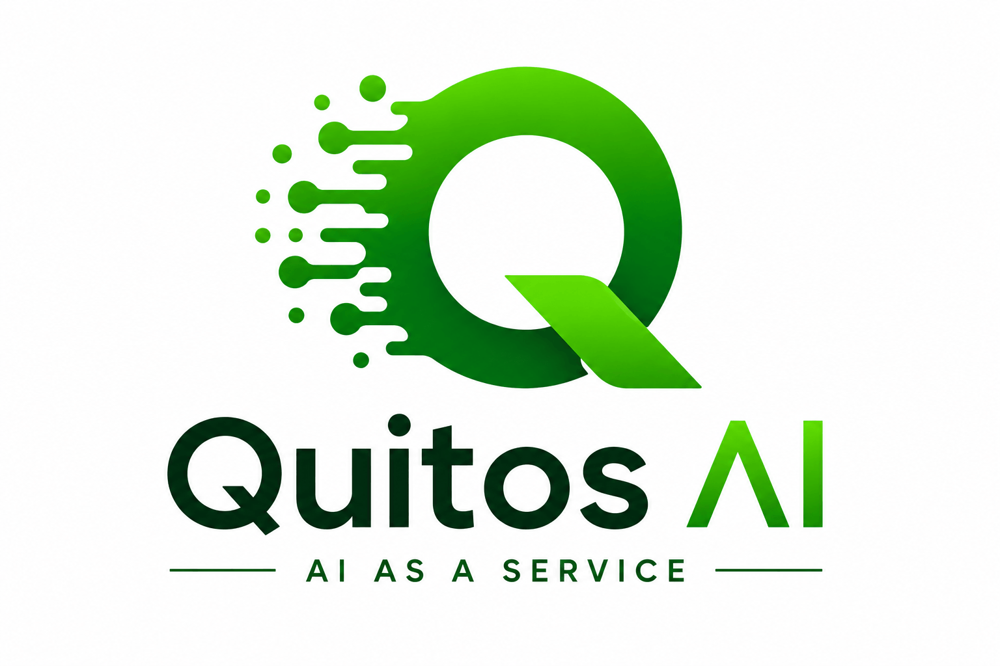

<div align="center">



# Quitos AI

**AI & Forward Deployed Engineering as a Service**

*Stop competing for talent in a saturated market. Deploy elite engineering to build, scale, and maintain your intelligence infrastructure.*

[](https://www.quitosai.com/)
[](https://www.quitosai.com/engineering)
[](https://www.quitosai.com/products)
[](https://www.quitosai.com/book)

</div>

---

## 🌐 Overview

**Quitos AI** delivers AI and Forward Deployed Engineering as a service — giving enterprises instant access to elite engineering talent without the cost, risk, and delay of building an internal AI team.

Building an internal AI team today is a multi-year gamble. Between salary competition and talent scarcity, most AI projects fail before they ship a durable product. Quitos AI ends the AI talent war by providing:

- ⚡ **Instant access** to senior AI engineering — no recruiting overhead
- 🛡️ **Zero retention risk** — our team is your team, on demand
- 🧹 **Managed technical debt** — we maintain the codebase as models, regulations, and workloads evolve

---

## 🚀 What We Do

### 1. Custom AI Engineering

Bespoke intelligence infrastructure designed for your proprietary data:

- **LLM Fine-Tuning** — domain-adapted models trained on your data
- **RAG Architectures** — retrieval-augmented generation pipelines built for accuracy and scale
- **Agentic Workflows** — autonomous, tool-using AI agents integrated into enterprise operations
- **Production Infrastructure** — data sanitation, model orchestration, deployment pipelines, and governance controls

→ [Explore Engineering Services](https://www.quitosai.com/engineering)

### 2. Proprietary AI Products

Off-the-shelf, high-performance AI modules ready for integration into enterprise ecosystems:

| Product | Description |
|---|---|
| **VectorDB Optimized Search** | High-performance semantic search built on optimized vector database architecture |
| **Automated Policy Enforcer** | Governance and compliance enforcement automated across your AI stack |
| **Enterprise-Grade Sandbox** | Secure, isolated environments for safe AI experimentation and evaluation |

→ [View AI Products](https://www.quitosai.com/products)

### 3. AI & Software Consultation

Strategic roadmap development and architectural validation for legacy-to-AI transitions. Avoid pilot purgatory with ROI-driven implementation, where every technical decision serves a business milestone.

→ [Book a Consultation](https://www.quitosai.com/book)

---

## 💡 The Quitos Advantage

| | Advantage | What It Means |
|---|---|---|
| **01** | **Speed to Market** | Launch in weeks, not quarters, with pre-built frameworks and senior implementation |
| **02** | **Zero Technical Debt** | We maintain the codebase as models, regulations, and workloads evolve |
| **03** | **Unfair Advantage** | Access proprietary optimization patterns unavailable in public playbooks |

---

## 🏗️ Core Capabilities

```
┌─────────────────────────────────────────────────────────┐
│                 QUITOS AI PLATFORM                      │
├─────────────────┬─────────────────┬─────────────────────┤
│  Custom AI      │  Proprietary    │  Strategic          │
│  Engineering    │  AI Products    │  Architecture       │
├─────────────────┼─────────────────┼─────────────────────┤
│ • LLM Fine-     │ • VectorDB      │ • AI Roadmaps       │
│   Tuning        │   Search        │ • Architecture      │
│ • RAG Systems   │ • Policy        │   Validation        │
│ • Agentic       │   Enforcer      │ • Legacy-to-AI      │
│   Workflows     │ • Enterprise    │   Transitions       │
│ • MLOps &       │   Sandbox       │ • ROI-Driven        │
│   Governance    │                 │   Implementation    │
└─────────────────┴─────────────────┴─────────────────────┘
```

We build **production intelligence infrastructure**: data sanitation, model orchestration, deployment pipelines, and governance controls — engineered for elite performance.

---

## 🧭 Who We Serve

Quitos AI partners with **enterprise teams** that need production-grade AI without the multi-year gamble of internal team building:

- Enterprises undertaking **legacy-to-AI transitions**
- Product teams that need **custom LLM capabilities** on proprietary data
- Organizations requiring **governed, compliant AI infrastructure**
- Leadership teams seeking **strategic AI roadmaps** tied to business milestones

---

## 🤝 Engagement Model

1. **Discover** — Strategy call to map your goals, data landscape, and constraints
2. **Architect** — ROI-driven technical roadmap with validated architecture
3. **Deploy** — Forward-deployed engineering builds and ships your solution
4. **Maintain** — Continuous upkeep as models, regulations, and workloads evolve

📅 [Schedule a Strategy Call](https://www.quitosai.com/book)

---

## 📫 Contact

- 🌍 **Website:** [quitosai.com](https://www.quitosai.com/)
- 🛠️ **Services:** [quitosai.com/engineering](https://www.quitosai.com/engineering)
- 📦 **Products:** [quitosai.com/products](https://www.quitosai.com/products)
- 🧠 **Consultation:** [quitosai.com/consultation](https://www.quitosai.com/consultation)
- ✉️ **Get in Touch:** [quitosai.com/contact](https://www.quitosai.com/contact)

---

<div align="center">

**Stop Waiting for AI. Start Deploying It.**

© 2026 Quitos AI. Engineering Elite. All rights reserved.

</div>
